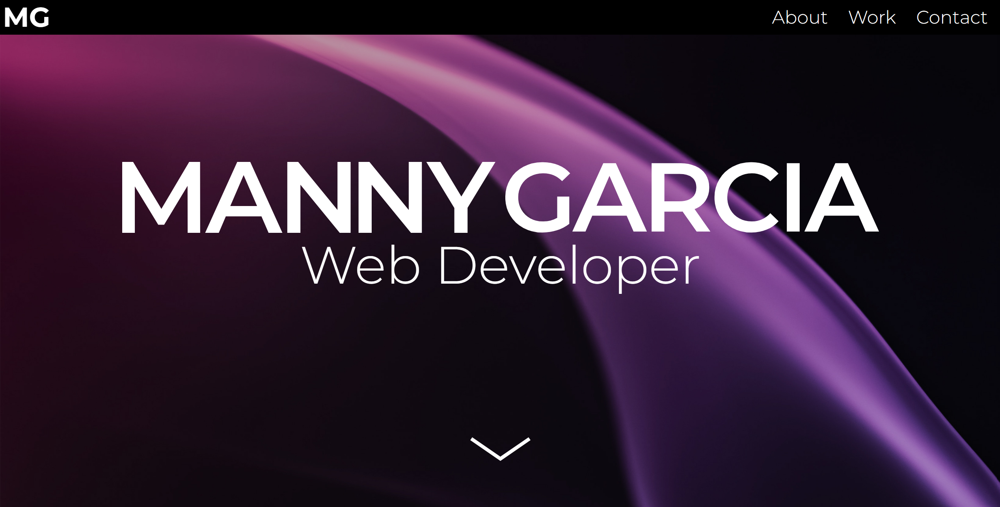

# Professional Portfolio - Webpage

This website was made to serve as a portfolio for the coding bootcamp I am participating in. All of the HTML and CSS was written from scratch.

<figure>
    
    <figcaption>Fullscreen hero section of portfolio.</figcaption>
</figure>

By starting this site from scratch, I got a lot of practice with how to organize my HTML in a way that makes it easy to style when it comes to css. When I began styling the page I began to realize how little I knew about positioning. With the help of W3 Schools and Stack Overflow I was able to overcome all the hurdles I faced when it came to background images and flexbox. I now have a better understanding of responsive web design and positioning.

<a href="https://mannygarcia98.github.io/Portfolio-Manny/" target="_blank">Click here to visit the site.</a>
